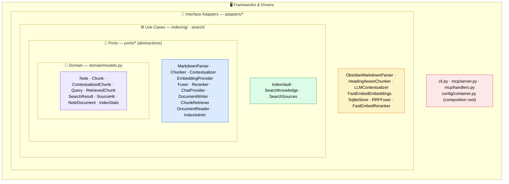
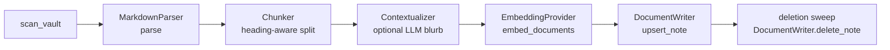
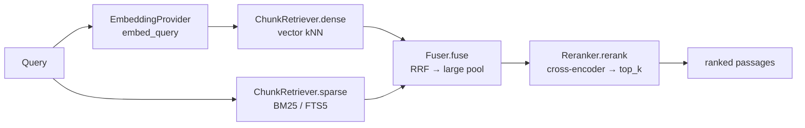
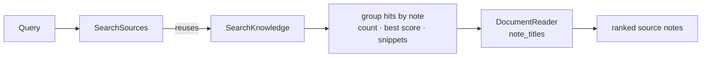

# Architecture

Ariostea is a local-first RAG (Retrieval-Augmented Generation) server that indexes an
Obsidian vault and exposes retrieval over the [Model Context Protocol](https://modelcontextprotocol.io)
(MCP). This document explains how it is built and *why* it is built that way. For a
higher-level tour and quick start, see the [README](README.md).

The guiding principle is **Clean Architecture** (ports & adapters): source-code
dependencies point only inward, toward more abstract and more stable code. The domain has
zero framework imports, use cases depend on *ports* (abstract Protocols) rather than
concrete adapters, and every concrete detail — SQLite, the embedding model, the MCP
framework — is wired together in exactly one place, the composition root.

## The layers

**Domain (`domain/models.py`)** — frozen dataclasses with no behaviour and no imports
beyond the standard library: `Note`, `Chunk`, `ContextualizedChunk`, `Query`,
`RetrievedChunk`, `SearchResult`, `SourceHit`, `NoteDocument`, `IndexStats`. These are the
vocabulary every other layer speaks in.

**Ports (`ports/*`)** — `typing.Protocol` abstractions describing *what* a collaborator
does, never *how*. Because they are structural (`@runtime_checkable`) Protocols, an adapter
implements a port simply by having the right methods — the dependency arrow points from the
adapter *to* the port, not the reverse.

**Use cases (`indexing/`, `search/`)** — the application logic: `IndexVault`,
`SearchKnowledge`, `SearchSources`. Each accepts its collaborators through the constructor,
typed only as ports. A use case can be exercised end-to-end against in-memory fakes.

**Interface adapters (`adapters/*`)** — the concrete implementations: parsing Obsidian
Markdown, chunking, embedding with fastembed, storing in SQLite, fusing with RRF, reranking
with a cross-encoder.

**Frameworks & drivers (`cli.py`, `mcp/`, `config/container.py`)** — the outermost shell:
the Typer CLI, the FastMCP server that turns tools into MCP endpoints, and the composition
root that wires everything together.

## Ports and their adapters

Each use case depends on a **narrow role-port** (Interface Segregation Principle). The most
visible payoff: a single `SqliteStore` implements *four* different ports, and each consumer
sees only the face it needs.

| Port (abstraction)  | Implemented by                          | Consumed by                        |
| ------------------- | --------------------------------------- | ---------------------------------- |
| `MarkdownParser`    | `ObsidianMarkdownParser`                | `IndexVault`                       |
| `Chunker`           | `HeadingAwareChunker`                   | `IndexVault`                       |
| `Contextualizer`    | `LLMContextualizer` / `NoopContextualizer` | `IndexVault`                    |
| `ChatProvider`      | `OpenAICompatChat`                      | `LLMContextualizer`                |
| `EmbeddingProvider` | `FastEmbedEmbeddings`                   | `IndexVault`, `SearchKnowledge`    |
| `DocumentWriter`    | `SqliteStore`                           | `IndexVault`                       |
| `IndexAdmin`        | `SqliteStore`                           | `IndexVault`, status / fingerprint |
| `ChunkRetriever`    | `SqliteStore`                           | `SearchKnowledge`                  |
| `DocumentReader`    | `SqliteStore`                           | `SearchSources`, `get_note`        |
| `Fuser`             | `RRFFuser`                              | `SearchKnowledge`                  |
| `Reranker`          | `FastEmbedReranker` / `NoopReranker`    | `SearchKnowledge`                  |

Two ports carry a design decision worth calling out:

- **`IndexStore` is a composite port** (`DocumentWriter` + `IndexAdmin`). The indexer needs
  both faces at once; Python has no intersection type, so the combination is named as a
  single Protocol rather than forcing the use case to declare two constructor parameters
  that always receive the same object.
- **`Contextualizer` and `Reranker` each ship a `Noop` implementation.** "Disabled" is not a
  branch inside the use case — it is a different adapter selected at the composition root.
  The use case has exactly one code path; whether contextualization or reranking happens is
  decided by *which object was injected*.

## Request flows

### Indexing (`reindex` tool / `ariostea reindex`)

`IndexVault.index` is **incremental**. It reads the store's `known_hashes()` up front and
skips any file whose content hash is unchanged, so a re-index only touches what actually
moved. Files that have disappeared from the vault are removed in a final deletion sweep
(anything in the store but not `seen` this pass).

Correctness hinges on a **config fingerprint**. The stored vectors are only valid for the
exact `embedding model | contextualizer` pair that produced them, because both influence the
`embedding_text` that was embedded. `IndexVault._fingerprint()` combines both fingerprints;
if it differs from the stored value, the incremental fast-path is bypassed and *every* note
is re-embedded. Swap the embedding model or toggle contextualization and the next index
rebuilds automatically — you can never silently mix vectors from two different models.

### Knowledge search (`search_knowledge` tool)

This is **hybrid retrieval with reranking**, and the division of labour between the three
ranking stages is deliberate:

1. **Dense + sparse retrieval run in parallel.** Dense (vector similarity over embeddings)
   catches paraphrase and cross-lingual matches; sparse (SQLite FTS5 / BM25) catches exact
   terms, identifiers, and rare tokens an embedding would smear away. Each contributes its
   own top-k candidates.
2. **RRF fusion is a recall gatherer, not the final ranker.** Reciprocal Rank Fusion merges
   the two candidate lists by rank position (ignoring the incomparable raw score scales of a
   cosine distance and a BM25 score). It is deliberately run to a *large* pool (`rerank.pool`,
   default 100) — its job is to assemble a high-recall candidate set, not to pick the winners.
3. **The cross-encoder reranker chooses the final `top_k`.** A bi-encoder embedding compares
   query and passage independently; a cross-encoder scores the (query, passage) *pair*
   jointly and is far more precise. Running it over the fused pool and keeping the best
   `top_k` is what turns good recall into good precision.

> **Why RRF alone is not enough.** RRF can bury a strong single-channel match: a passage that
> only the dense channel found sits low in the fused list even when it is the best answer.
> The reranker re-scores by true query-passage relevance and rescues those matches — this is
> the reason reranking exists as its own stage rather than trusting fused order.

### Source search (`search_sources` tool)

`search_sources` answers a different question — *which notes* discuss a concept, rather than
*which passages* are most relevant. It is a thin composition over `SearchKnowledge`: run a
broad knowledge search, roll the passage hits up by source note (hit count, best score,
representative snippets), then decorate with titles via `DocumentReader`. `get_note` completes
the loop, fetching a full note's reconstructed text by its vault-relative path.

## The composition root

`config/container.py` is the **only** module that imports concrete adapters. `build_container`
reads the validated `Config`, constructs each adapter, and injects it into the use cases as
its narrow role — the same `SqliteStore` instance handed to `IndexVault` as a `DocumentWriter`
and to `SearchKnowledge` as a `ChunkRetriever`. The returned `Container` exposes config, the
use cases, and the `IndexAdmin` port for status — never the concrete adapters, which are
wiring internals.

The container is also where **graceful degradation** lives. `_build_reranker` and
`_build_contextualizer` fall back to their `Noop` counterparts (with a logged warning) if a
model cannot be loaded or a service is misconfigured. A missing reranker degrades ranking
quality; it never fails a search.

## Configuration

`config/schema.py` defines the config as Pydantic models loaded from `ariostea.toml`
(`tomllib` → validated `Config`). Only `[vault].path` is required; every other value has a
built-in default, so the zero-configuration install runs plain hybrid search with local,
keyless models. Optional sections layer on capability: `[rerank]` (on by default,
multilingual cross-encoder), `[contextual]` (off by default; prepends an LLM-written
note-level blurb to each chunk before embedding, per Anthropic's
[Contextual Retrieval](https://www.anthropic.com/news/contextual-retrieval) method), and
`[server]` (HTTP transport bind address). See
[`ariostea.example.toml`](ariostea.example.toml) for the annotated defaults.

## Why this shape pays off

- **Swappable everything.** The embedding model, store, fusion, reranking, and
  contextualization all sit behind ports. Swapping the embedder from English-only to
  multilingual, or adding the BM25 + RRF + reranking stack, touched zero use-case code.
- **Testable without frameworks.** Use cases are tested against in-memory fakes of the ports,
  so the fast suite needs no SQLite file and no model download. Tests that load real models
  are marked `integration` and are opt-in (`pytest -m "not integration"` for the fast path).
- **One place to reason about wiring.** Every "how are these connected?" question has a single
  answer: read `build_container`. Nothing else knows a concrete type.
- **Retrieval quality is a measurable, not a vibe.** An offline eval harness (`eval/`, with a
  multilingual gold set) scores each retrieval channel, which is how the value of hybrid
  search, contextual retrieval, and reranking was verified rather than assumed.

## Code map

| Path                     | Responsibility                                                |
| ------------------------ | ------------------------------------------------------------- |
| `domain/models.py`       | Framework-free domain types.                                  |
| `ports/`                 | Protocol abstractions every use case depends on.              |
| `indexing/`              | `IndexVault` use case, vault scanner, filesystem watcher.     |
| `search/`                | `SearchKnowledge` and `SearchSources` use cases.              |
| `adapters/`              | Concrete implementations of the ports.                        |
| `config/`                | Config schema (`schema.py`) and composition root (`container.py`). |
| `mcp/`                   | FastMCP server (`server.py`) and tool handlers (`handlers.py`). |
| `cli.py`                 | Typer CLI: `serve`, `reindex`, `watch`, `status`.             |
| `eval/`                  | Offline retrieval-quality harness and gold sets.              |
