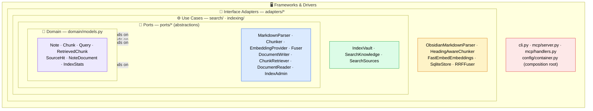
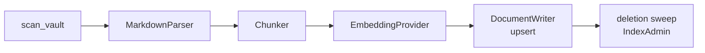
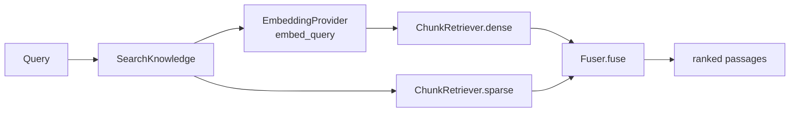
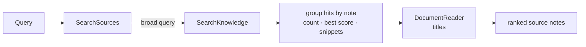

# Ariostea

Local-first, Obsidian-aware **RAG MCP server**. Point it at an Obsidian vault and it
indexes your notes incrementally, then exposes retrieval to any MCP client (e.g. Claude)
through five tools. Built on Anthropic's Contextual Retrieval method.

Two retrieval modes:

- **`search_knowledge`** — the most relevant *passages* (hybrid dense + BM25, fused with RRF).
- **`search_sources`** — *which notes* a concept appears in (provenance rollup), plus `get_note` to fetch one in full.

## Architecture

Ariostea follows **Clean Architecture** (ports & adapters). Source-code dependencies point
**only inward** — every arrow below goes toward more abstract, more stable code. Inner layers
know nothing about the outer ones: the domain has zero framework imports, use cases depend on
*ports* (not concrete adapters), and concrete details (SQLite, fastembed, the MCP framework)
are wired together in exactly one place — the composition root.



> Every dependency arrow points **inward**, toward more abstract and more stable code.
> The domain has zero framework imports; use cases depend on *ports*, never on the
> concrete adapters that implement them.

### Ports → Adapters

Each use case depends on a **narrow role-port** (Interface Segregation). The same
`SqliteStore` implements four of them; consumers only see the face they need.

| Port (abstraction)      | Implemented by         | Used by                          |
| ----------------------- | ---------------------- | -------------------------------- |
| `MarkdownParser`        | `ObsidianMarkdownParser` | `IndexVault`                   |
| `Chunker`               | `HeadingAwareChunker`  | `IndexVault`                     |
| `EmbeddingProvider`     | `FastEmbedEmbeddings`  | `IndexVault`, `SearchKnowledge`  |
| `DocumentWriter`        | `SqliteStore`          | `IndexVault`                     |
| `ChunkRetriever`        | `SqliteStore`          | `SearchKnowledge`                |
| `DocumentReader`        | `SqliteStore`          | `SearchSources`, `get_note`      |
| `IndexAdmin`            | `SqliteStore`          | status / fingerprint guard       |
| `Fuser`                 | `RRFFuser`             | `SearchKnowledge`                |

> `IndexStore` is a composite port (`DocumentWriter` + `IndexAdmin`) — Python has no
> intersection type, so the combination the indexer needs is named as one Protocol.

### Request flow

**Indexing** (`reindex` tool / CLI):



**Knowledge search** (`search_knowledge` tool):



**Source search** (`search_sources` tool):



### Why this shape

- **Swappable everything.** The embedding model, store, and fusion strategy are all behind
  ports — swapping the embedder (English → multilingual) or adding BM25+RRF touched zero
  use-case code.
- **Testable without frameworks.** Use cases are tested against in-memory fakes of the ports;
  no SQLite or model download required for the fast suite.
- **One composition root.** `config/container.py` is the *only* module that imports concrete
  adapters; it injects each store into a use case as its narrow role.

## MCP tools

| Tool               | Returns                                                            |
| ------------------ | ----------------------------------------------------------------- |
| `status`           | Index health: note/chunk counts, last index time, fingerprint.    |
| `reindex`          | (Re)indexes the configured vault; returns note/chunk counts.      |
| `search_knowledge` | Most relevant passages with their source notes.                   |
| `search_sources`   | Which notes a concept appears in — hit count, best score, snippets.|
| `get_note`         | A full note's reconstructed text and title by vault-relative path. |

## Quick start

```bash
# 1. Configure — point at your vault
cp ariostea.example.toml ariostea.toml   # then edit [vault] path

# 2. Build the index
uv run ariostea reindex                  # or: uvx ariostea reindex

# 3. Run the stdio MCP server
uv run ariostea serve                    # or: uvx ariostea serve

# Other commands
uv run ariostea watch                    # index, then auto-reindex on vault edits
uv run ariostea status                   # print index health
uv run pytest -m "not integration"       # fast test suite
```

Configuration lives in `ariostea.toml` (`[vault]`, `[embedding]`, `[store]`, `[search]`);
see [`ariostea.example.toml`](ariostea.example.toml) for all options and defaults.
