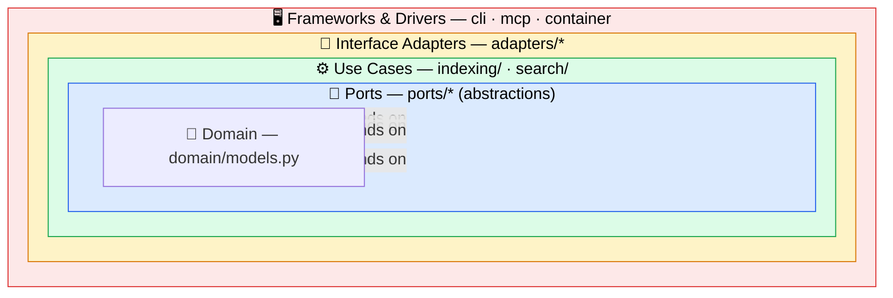

# Ariostea

[](https://github.com/paull78/ariostea/actions/workflows/ci.yml)
[](https://www.python.org/)
[](LICENSE)

Local-first, Obsidian-aware **RAG MCP server**. Point it at an Obsidian vault and it
indexes your notes incrementally, then exposes retrieval to any MCP client (e.g. Claude)
through five tools. Everything runs on-device with local, keyless models by default; the
optional LLM step follows Anthropic's [Contextual Retrieval](https://www.anthropic.com/news/contextual-retrieval)
method.

Two retrieval modes:

- **`search_knowledge`** — the most relevant *passages* (hybrid dense + BM25, fused with RRF, then reranked).
- **`search_sources`** — *which notes* a concept appears in (provenance rollup), plus `get_note` to fetch one in full.

> This is a personal learning project — a from-scratch, dependency-light study in building a
> production-shaped RAG pipeline (hybrid retrieval, contextual retrieval, cross-encoder
> reranking) on top of a strict **Clean Architecture** (ports & adapters) skeleton.

## Architecture

Ariostea follows **Clean Architecture**: source-code dependencies point **only inward**,
toward more abstract and more stable code. The domain has zero framework imports, use cases
depend on *ports* (abstract Protocols) rather than concrete adapters, and every concrete
detail — SQLite, the embedding model, the MCP framework — is wired together in exactly one
place, the composition root (`config/container.py`).



The payoff, in one line each:

- **Swappable everything** — the embedding model, store, fusion, reranking, and
  contextualization all sit behind ports; swapping English → multilingual embeddings, or
  adding the whole BM25 + RRF + reranking stack, touched zero use-case code.
- **Testable without frameworks** — use cases run against in-memory fakes, so the fast suite
  needs no SQLite file and no model download.
- **One composition root** — `config/container.py` is the only module that imports concrete
  adapters and injects each into a use case as its narrow role.

The retrieval pipeline is **hybrid + reranked**: dense vector search and BM25 run in
parallel, RRF fuses them into a high-recall pool, and a cross-encoder reranker picks the
final results by true query-passage relevance.

📖 **For the full design — every port and adapter, the indexing/search request flows, the
config-fingerprint guard, and the rationale behind each ranking stage — see
[ARCHITECTURE.md](ARCHITECTURE.md).**

## MCP tools

| Tool               | Returns                                                            |
| ------------------ | ----------------------------------------------------------------- |
| `status`           | Index health: note/chunk counts, last index time, fingerprint.    |
| `reindex`          | (Re)indexes the configured vault; returns note/chunk counts.      |
| `search_knowledge` | Most relevant passages with their source notes.                   |
| `search_sources`   | Which notes a concept appears in — hit count, best score, snippets.|
| `get_note`         | A full note's reconstructed text and title by vault-relative path. |

## Quick start

Requires Python 3.12+ and [uv](https://docs.astral.sh/uv/).

```bash
# 1. Configure — point at your vault
cp ariostea.example.toml ariostea.toml   # then edit [vault] path

# 2. Build the index
uv run ariostea reindex

# 3. Run the stdio MCP server
uv run ariostea serve

# Other commands
uv run ariostea watch                    # index, then auto-reindex on vault edits
uv run ariostea status                   # print index health
uv run pytest -m "not integration"       # fast test suite
```

Configuration lives in `ariostea.toml`. Only `[vault].path` is required; every other value
has a built-in default (`[embedding]`, `[store]`, `[search]`, `[rerank]`, `[contextual]`,
`[server]`). See [`ariostea.example.toml`](ariostea.example.toml) for all options and
defaults.

### Connecting an MCP client

**Claude Code / Claude Desktop** — register the stdio server:

```bash
claude mcp add ariostea -- uv run --directory /path/to/ariostea ariostea serve
```

**HTTP clients (e.g. n8n)** — serve over Streamable HTTP instead of stdio:

```bash
uv run ariostea serve --transport http --host 0.0.0.0 --port 8000
# MCP endpoint: http://<host>:8000/mcp
```

## Development

```bash
uv sync                             # install deps
uv run pytest -m "not integration"  # fast unit suite (no model downloads)
uv run pytest                       # full suite, incl. tests that load real models
uv run ruff check .                 # lint
uv run ruff format .                # format
```

## License

[MIT](LICENSE).
