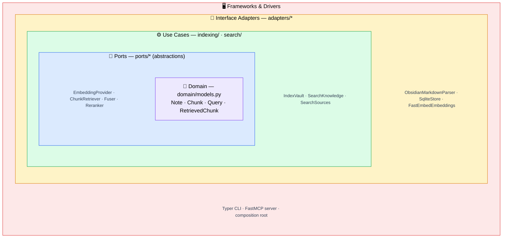

# Ariostea

[](https://github.com/paull78/ariostea/actions/workflows/ci.yml)
[](https://www.python.org/)
[](LICENSE)

Ariostea is a local-first RAG server for an Obsidian vault. Point it at the vault and it
indexes the notes incrementally, then exposes retrieval to any MCP client, Claude included,
through five tools. Everything runs on the machine with local, keyless models. An optional LLM
step can add context to each chunk before indexing, following Anthropic's
[Contextual Retrieval](https://www.anthropic.com/news/contextual-retrieval) method. Measured
on the eval corpus it did not pay, so it is off by default.

Two retrieval modes:

- `search_knowledge` returns the most relevant passages. Dense and BM25 search run in
  parallel, RRF fuses them, and a cross-encoder reranks the pool.
- `search_sources` returns which notes a concept appears in, and `get_note` fetches one in
  full.

> This is a personal learning project: a RAG pipeline (hybrid retrieval, contextual
> retrieval, cross-encoder reranking) built from scratch with few dependencies, on a strict
> Clean Architecture skeleton.

## How it is built

Ariostea follows Clean Architecture. Source-code dependencies point only inward, toward the
more abstract and more stable code. The domain has no framework imports, use cases depend on
ports (Protocols) rather than concrete adapters, and every concrete detail, SQLite, the
embedding model, the MCP framework, is wired in one place, the composition root
`config/container.py`.


```mermaid
flowchart TB
    subgraph FD["🖥️ Frameworks & Drivers"]
        FDex["Typer CLI · FastMCP server · composition root"]
        subgraph IA["🔌 Interface Adapters — adapters/*"]
            IAex["ObsidianMarkdownParser · SqliteStore · FastEmbedEmbeddings"]
            subgraph UC["⚙️ Use Cases — indexing/ · search/"]
                UCex["IndexVault · SearchKnowledge · SearchSources"]
                subgraph PO["🧩 Ports — ports/* (abstractions)"]
                    POex["EmbeddingProvider · ChunkRetriever · Fuser · Reranker"]
                    DM["💎 Domain — domain/models.py<br/>Note · Chunk · Query · RetrievedChunk"]
                end
            end
        end
    end

    classDef fd fill:#fde8e8,stroke:#d33,color:#000;
    classDef ia fill:#fef3c7,stroke:#d97706,color:#000;
    classDef uc fill:#dcfce7,stroke:#16a34a,color:#000;
    classDef po fill:#dbeafe,stroke:#2563eb,color:#000;
    classDef dm fill:#ede9fe,stroke:#7c3aed,color:#000;
    classDef ex fill:transparent,stroke-width:0px,color:#334155,font-size:13px;
    class FD fd; class IA ia; class UC uc; class PO po; class DM dm;
    class FDex,IAex,UCex,POex ex;
```

Each layer may depend only on the layers inside it. The innermost `domain` knows nothing
about anything outside it, and the outer shell knows about everything.

What this buys:

- The embedding model, store, fusion, reranking and contextualisation all sit behind ports.
  Swapping the English embedding model for a multilingual one, or adding the whole BM25 + RRF
  + reranking stack, touched no use-case code.
- Use cases run against in-memory fakes, so the fast test suite needs no SQLite file and no
  model download.
- `config/container.py` is the only module that imports concrete adapters, and it injects
  each one into a use case as its narrow role.

A search runs dense retrieval and BM25 in parallel, RRF fuses them into a high-recall pool,
and a cross-encoder reranker picks the final results by query-passage relevance.

[ARCHITECTURE.md](ARCHITECTURE.md) covers every port and adapter, the indexing and search
flows, the config-fingerprint guard, and the reason for each ranking stage.

## MCP tools

| Tool               | Returns                                                            |
| ------------------ | ----------------------------------------------------------------- |
| `status`           | Index health: note and chunk counts, last index time, fingerprint. |
| `reindex`          | (Re)indexes the configured vault and returns note and chunk counts. |
| `search_knowledge` | Most relevant passages with their source notes.                   |
| `search_sources`   | Which notes a concept appears in: hit count, best score, snippets. |
| `get_note`         | A full note's reconstructed text and title by vault-relative path. |

## Example

Once connected, an MCP client calls the tools. Asking for passages about a concept:

```jsonc
// search_knowledge(query="how does reciprocal rank fusion combine results", k=3)
{
  "results": [
    {
      "note_path": "notes/retrieval/hybrid-search.md",
      "heading_path": ["Fusion", "RRF"],
      "text": "Reciprocal Rank Fusion merges two ranked lists by summing 1/(k + rank) for each result across lists, so an item ranked highly by either channel floats up without needing comparable raw scores.",
      "score": 0.94   // reranker relevance score
    },
    {
      "note_path": "notes/retrieval/bm25.md",
      "heading_path": ["Lexical search"],
      "text": "BM25 scores are not comparable to cosine distances, which is why fusion works on ranks rather than raw scores.",
      "score": 0.61
    }
  ]
}
```

`search_sources` answers the other question, which notes discuss a concept, and returns notes
with hit counts, best score and snippets.

## Quick start

Requires Python 3.12+ and [uv](https://docs.astral.sh/uv/).

```bash
# 1. Configure — point at your vault
cp ariostea.example.toml ariostea.toml   # then edit [vault] path

# 2. Build the index
uv run ariostea reindex

# 3. Run the stdio MCP server
uv run ariostea serve

# Other commands
uv run ariostea watch                    # index, then auto-reindex on vault edits
uv run ariostea status                   # print index health
uv run pytest -m "not integration"       # fast test suite
```

Configuration lives in `ariostea.toml`. Only `[vault].path` is required, and every other
value has a built-in default. [`ariostea.example.toml`](ariostea.example.toml) lists all
options and defaults.

### Connecting an MCP client

For Claude Code or Claude Desktop, register the stdio server:

```bash
claude mcp add ariostea -- uv run --directory /path/to/ariostea ariostea serve
```

For HTTP clients, n8n for example, serve over Streamable HTTP instead of stdio:

```bash
uv run ariostea serve --transport http --host 0.0.0.0 --port 8000
# MCP endpoint: http://<host>:8000/mcp
```

## Development

```bash
uv sync                             # install deps
uv run pytest -m "not integration"  # fast unit suite (no model downloads)
uv run pytest                       # full suite, incl. tests that load real models
uv run ruff check .                 # lint
uv run ruff format .                # format
```

## The learning journey

The pipeline was built first and measured after. Each stage (hybrid retrieval, reranking,
contextual retrieval) is a known technique, and the question was whether it holds up on real
material. Answering it needed an evaluation that can detect a change of a few cases. Every
number below comes from `eval/results/runs.jsonl`. The full account, with every figure and the
reproduction commands, is in [docs/retrieval-tuning.md](docs/retrieval-tuning.md).

### The instrument

`eval/wiki/` holds 79 Wikipedia articles in 6 topic clusters (board games, cheese, coffee,
cycling, sailing, string instruments), pinned to revision IDs so the snapshot rebuilds byte
for byte. Articles in a cluster share vocabulary, so every query has near misses to reject.

`eval/wiki/gold.json` holds 167 queries over that corpus. Each points at the text span that
answers it, not just the note, and a retrieved chunk counts as a hit only when it contains the
whole span. The labels stay valid under any chunking policy, which is what made chunking
measurable at all.

| type | stresses | cases |
|---|---|---|
| paraphrase | dense embeddings | 40 |
| exact_term | BM25 full-text search | 41 |
| buried | facts deep inside a long section | 40 |
| cross_lingual | Italian and Spanish queries over English articles | 46 |

The set is LLM-generated. A local model wrote candidates from 505 passages, a different model
judged them, and they passed five gates: span verification, the adversarial judge, a filter
dropping queries every channel already answers at rank 1, an ambiguity gate, and a human spot
review. 338 candidates were rejected, each with its reason in `eval/wiki/gold_rejected.json`.

Every run goes into `eval/results/runs.jsonl` with its configuration, commit and every metric
per channel and query type, compared against a named control. `eval/results/experiment_log.html`
renders the log as a table shaded green for gains and magenta for losses, grey within ±0.03,
the smallest change 167 queries can resolve, about 5 cases.

A decision rule was fixed before any result was in. A change replaces a default only if hybrid
span recall gains at least 0.03, no query type loses more than 0.05, and at least 160 of 167
answers stay reachable.

### Baseline

Span recall at k=5 with the original chunking, 512 words with no overlap:

| channel | span recall | cross_lingual |
|---|---|---|
| dense | 0.335 | 0.391 |
| sparse (BM25) | 0.605 | 0.022 |
| hybrid (fused, reranked) | 0.832 | 0.630 |

Hybrid is what the server serves. Dense at 0.335 was far too low for a multilingual embedding
model on this material.

### Trial 1: chunking

Measuring what the embedding model reads explained the dense number. The size cap counted
words, the model counts subword tokens, and Italian and Spanish run well over one token per
word. 299 chunks, 1 in 5, were longer than the model's 512-token input, and fastembed
truncates silently, so the dense channel embedded only the start of those. 15 answers sat past
the cut, unreachable by dense retrieval at any rank.

The fix was to size chunks in model tokens, with overlap so no answer is cut in half. A sweep
of 9 policies ran dense and sparse first, then hybrid for the 3 best, then a confirmation run,
then the same again with the reranker switched off.

| policy | dense | hybrid | hybrid cross_lingual | fused (no reranker) |
|---|---|---|---|---|
| 512 words (control) | 0.335 | 0.832 | 0.630 | 0.551 |
| 160 tokens, overlap 40 | 0.545 | 0.880 (+0.048) | 0.696 | 0.629 (+0.078) |


160 tokens with 40 of overlap was the only policy that passed the rule with the reranker and
without it, and it is the default now. The hybrid gain is probably smaller than +0.048, since
the neighbouring policies gained +0.006 to +0.018, so part of it is luck. Without the reranker
the gain is large and steady, +0.06 to +0.09 for every policy, because the reranker had been
absorbing most of the damage the word cap did. The change is a fix for silent truncation more
than a tuning win, and upgrading re-chunks and re-embeds a vault once.

### Trial 2: note-level blurbs

Contextual indexing asks an LLM for one short blurb per note, its topic and key entities, and
prepends it to every chunk before embedding and indexing. On the earlier eval corpus, 19 short
documents of one chunk each, it had lifted dense and sparse retrieval, while hybrid stayed
flat because the reranker scored the raw chunk. The trial asked two questions: do blurbs help
on the wiki set, and does letting the reranker see them help hybrid.

| configuration | dense | hybrid | hybrid cross_lingual |
|---|---|---|---|
| no blurbs (control) | 0.545 | 0.880 | 0.696 |
| blurbs, reranker scores the raw chunk | 0.503 | 0.844 (−0.036) | 0.609 |
| blurbs, reranker scores blurb and chunk | | 0.814 (−0.066) | 0.609 |

Both fail the rule, so blurbs stay off, and the dense channel shows why. Note recall went up,
0.826 to 0.850, so the blurb helps find the right article. Span recall went down, and on the
29 cases the gold set had dropped as too easy it fell from 0.931 to 0.759. A wiki article here
is dozens of chunks that all carry the same blurb, so their vectors move toward each other and
the right chunk is harder to pick out of its own article. The earlier lift came from one-chunk
notes, where that cannot happen.

### Trial 3: per-chunk context

Anthropic's Contextual Retrieval writes the context per chunk instead. The prompt holds the
whole document and one chunk, and asks for a short text that situates that chunk. Every chunk
gets a different context, which targets the convergence above. All 4,246 chunks got one, from
a local `qwen2.5-7b-instruct` in three and a half hours. The 14B model at a 32k context ran
the Mac out of GPU memory and panicked it on both attempts.

| configuration | dense | fused (no reranker) | hybrid | hybrid cross_lingual |
|---|---|---|---|---|
| no context (control) | 0.545 | 0.629 | 0.880 | 0.696 |
| per-chunk context, reranker scores the raw chunk | 0.581 (+0.036) | 0.665 (+0.036) | 0.850 (−0.030) | 0.630 |
| per-chunk context, reranker sees the context | | | 0.856 (−0.024) | 0.652 |

It fixes what the blurbs broke. Dense goes up instead of down, the easy cases stay at 0.931,
and every stage before the reranker gains. The gain does not survive the reranker. The
cross-encoder already reads chunk and query together, so the context adds little it lacks,
and the changed candidate pool costs a few cases, 3 of them cross-lingual. Hybrid fails the
rule either way, so contextual indexing stays off. The per-chunk option stays in the code for
a setup without a reranker, where it gains +0.036.

### Where it stands

The defaults are the measured configuration: 160-token chunks with 40 of overlap, the
multilingual `paraphrase-multilingual-mpnet-base-v2` embeddings every run used, the
`jina-reranker-v2-base-multilingual` reranker on, contextual indexing off. Until 2026-10-09
the shipped embedding default was an English-only model nobody had measured. Hybrid span
recall is 0.880.

The weak spot is cross-lingual, 0.696 on the 46 Italian and Spanish queries against 0.90 or
better on the other three types, and BM25 cannot help there at all, 0.022. Both context trials
hurt it most. The next trial is the embedding model.

## Licence

[MIT](LICENSE).

`eval/wiki/` is different: it holds Wikipedia article text used as a retrieval-evaluation
corpus, licensed under [CC BY-SA 4.0](https://creativecommons.org/licenses/by-sa/4.0/) and
modified (converted to Markdown, links rewritten as wikilinks, infoboxes and references
stripped). `eval/wiki/NOTICE` records the licence, the modifications, and a permalink to the
exact revision of every article in the snapshot. Redistributing that text, or adaptations of
it, carries the share-alike obligation. The surrounding source code remains MIT.

The snapshot is rebuilt with:

```bash
uv run python eval/build_wiki_corpus.py   # re-fetches every pinned revision
```

Because every article is pinned to a revision ID in `eval/wiki/clusters.json`, that command
reproduces the committed corpus byte for byte.
