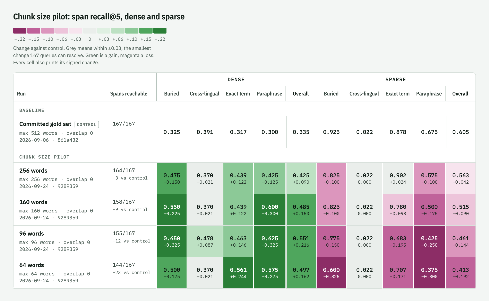
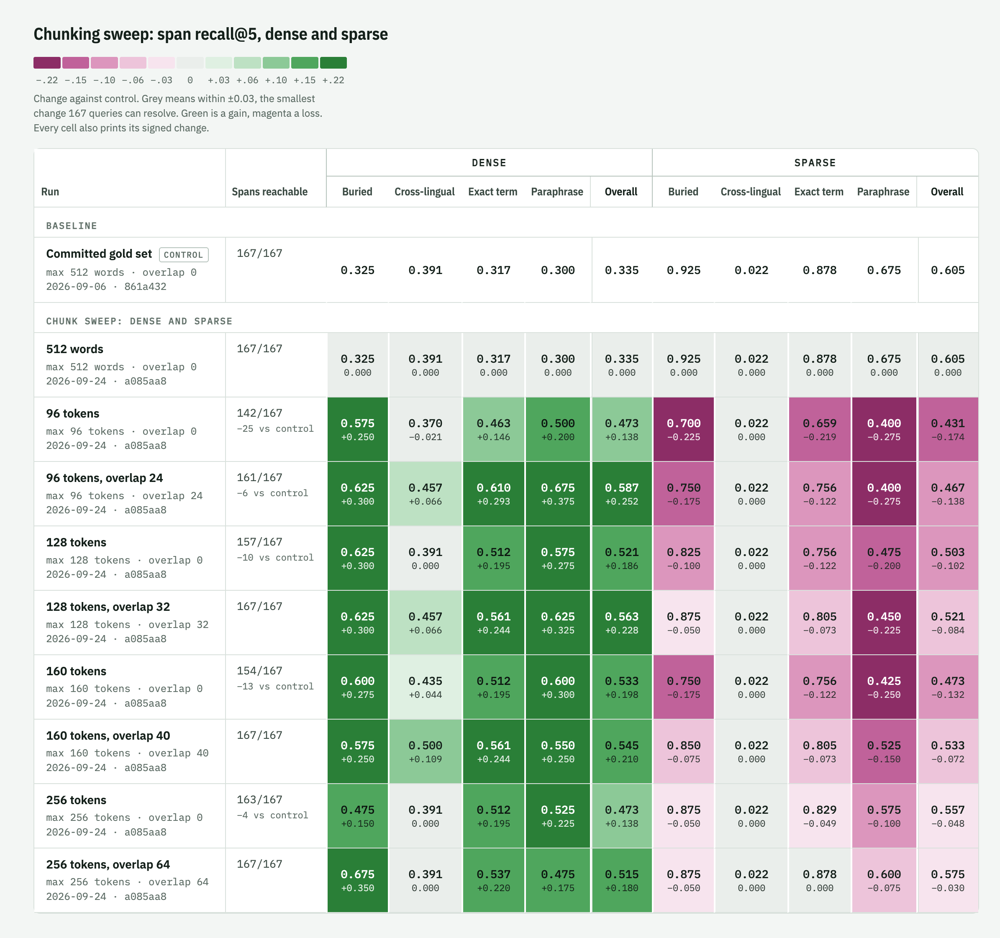
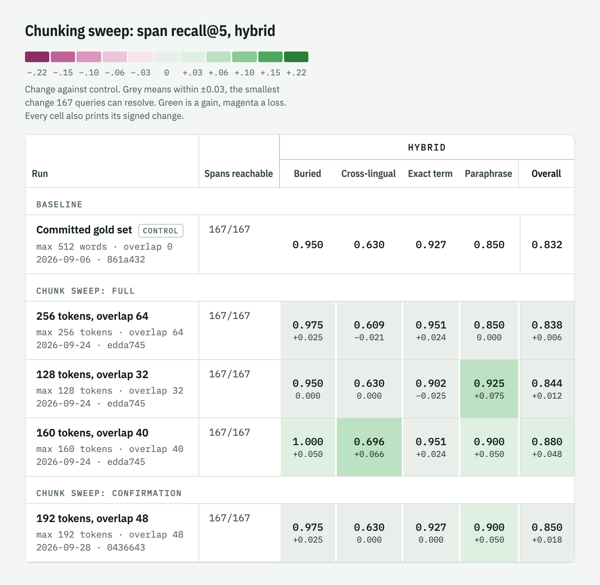
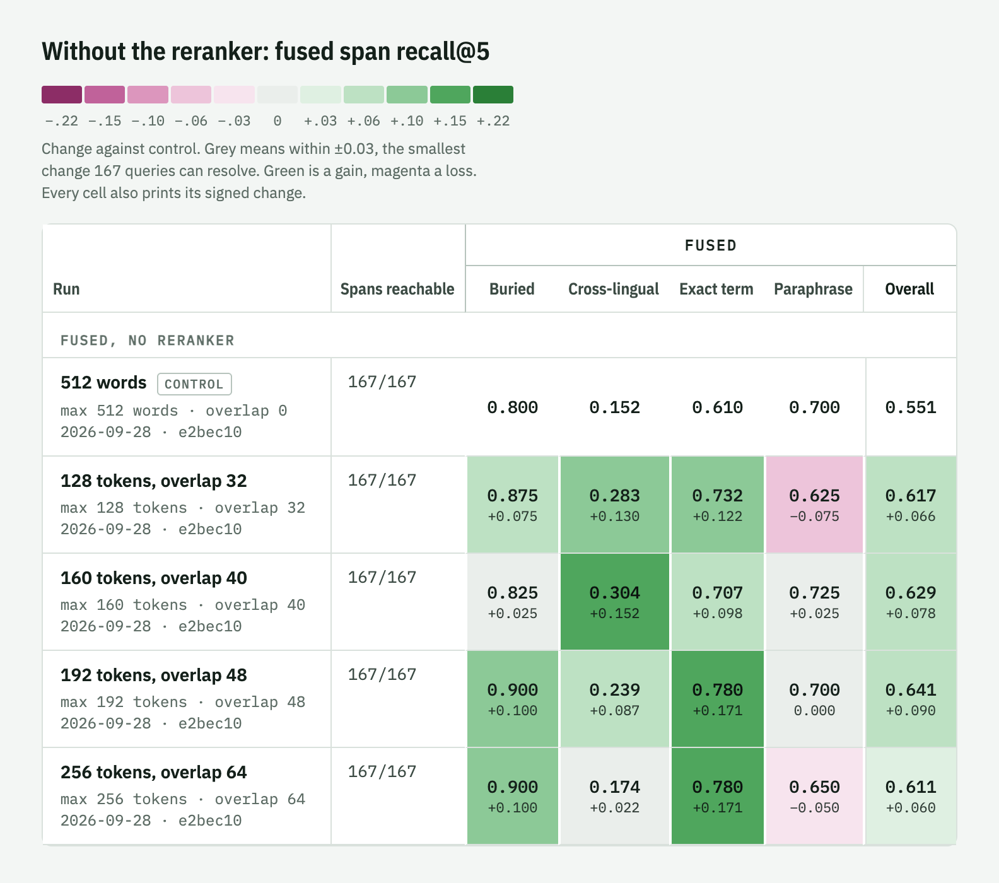

# Tuning retrieval

How Ariostea's chunking policy was measured and replaced, from building an evaluation set that
could detect a difference to the sweeps that picked the new default, and how contextual blurbs
were measured and kept off. Every number here comes from `eval/results/runs.jsonl`, and every
figure is a view of the experiment log page rendered from it.

## The instrument

Before this work, the eval corpus was 19 short documents, one chunk each. Chunking could not be
measured on it at all: there was nothing to chunk differently.

The replacement is a snapshot of 79 Wikipedia articles in 6 topic clusters (board games, cheese,
coffee, cycling, sailing, string instruments), pinned to revision IDs so it rebuilds byte for
byte. Articles in a cluster share vocabulary, so every query has near misses to reject.

On top of it sits a gold set of 167 queries. Each points at the **text span** that answers it,
not just the note, and a retrieved chunk counts as a hit only when it contains that span whole.
The same labels stay valid under any chunking policy, which is what makes chunking measurable.

Queries come in four types, one per retrieval mechanism:

| type | stresses | cases |
|---|---|---|
| paraphrase | dense embeddings | 40 |
| exact_term | BM25 full-text search | 41 |
| buried | facts deep inside a long section | 40 |
| cross_lingual | Italian and Spanish queries over English articles | 46 |

A local model (`qwen2.5-14b-instruct`) generated candidates from 505 passages. A different
local model (`qwen3.6-35b-a3b`) judged them. They passed five gates: automatic span checks, the
adversarial judge, a filter dropping queries every channel already answers at rank 1, an
ambiguity gate rejecting queries another passage answers just as well, and a human spot review
of 19 sampled cases, 17 of which were sound. 338 candidates were rejected, each recorded with
its reason in `eval/wiki/gold_rejected.json`.

## Baseline

The first reading, with the original policy: split at every heading, then cut sections longer
than 512 words into consecutive pieces with no overlap.

| channel | span recall@5 | span MRR |
|---|---|---|
| dense | 0.335 | 0.209 |
| sparse (BM25) | 0.605 | 0.502 |
| hybrid (fused, reranked) | 0.832 | 0.789 |

Hybrid is what the MCP server serves. Dense at 0.335 stood out as far too low for a
multilingual embedding model on this material.

## Why chunking first

Measuring what the embedding model actually reads explained the dense number.

| measurement | value |
|---|---|
| chunks in the corpus | 1549 |
| median chunk | 157 words, 239 model tokens |
| chunks longer than the model's 512-token input | 299 (19%) |
| chunks longer than 128 tokens, the model's training length | 1116 (72%) |
| gold spans ending past token 512 of their chunk | 15 of 167 |

The size cap counted words, while `paraphrase-multilingual-mpnet-base-v2` counts subword
tokens, and Italian and Spanish run well over one token per word. fastembed truncates silently
at 512 tokens, so for 1 chunk in 5 the dense channel embedded only the start of the text. 15
answers sat past the cut, unreachable by dense retrieval at any rank.

The reranker (`jina-reranker-v2-base-multilingual`) reads 1024 tokens, and the longest chunk is
928, so hybrid's final ranking always saw whole chunks. Truncation hurt only the dense channel's
contribution to the candidate pool.

## Pilot: smaller chunks

A scratch sweep over the size cap, dense and sparse only, since hybrid costs about an hour per
configuration on CPU.



Dense improved at every step down to 96 words, from 0.335 to 0.551. Sparse got worse at every
step, from 0.605 to 0.461: BM25 needs enough surrounding text for a query's terms to land in the
same chunk. And coverage fell. With no overlap, an answer that straddles a cut is contained in
no chunk and scores zero everywhere; at 64 words that was 23 of 167 answers.

The two channels pulled in opposite directions, so hybrid could go either way. It had to be
measured.

## Making chunking configurable

The pilot needed code changes before a real sweep could run.

- A `[chunking]` section in the config: `max_tokens`, `overlap`, and `unit` (`"words"` or
  `"model_tokens"`). The defaults reproduce the original chunker byte for byte, and a test pins
  that against the whole corpus.
- Overlap: each piece repeats the tail of the previous one, never across a heading.
- Sizing in model tokens, counted with the embedding model's own tokenizer, so a cap of 128
  means the same thing in every language.
- A chunker fingerprint in the index. Before this, the index fingerprint covered the embedding
  model and the contextualiser but not the chunker, so changing the policy would have left
  every unchanged note with its old chunks and no warning.

## The experiment log

Every run is appended to `eval/results/runs.jsonl` with its configuration, commit, coverage,
and every metric per channel and query type, compared against a named control run.
`eval/render_results.py` turns it into a page where each cell is shaded by its change against
the control: green for a gain, magenta for a loss, grey within ±0.03. That band is the smallest
change 167 queries can resolve, about 5 cases. Every cell also prints its signed change, so the
colour never carries the information alone.

## Decision rule

Fixed before any hybrid run, so the result could not be picked after seeing it. A policy
replaces the default only if:

- hybrid span recall beats the control by at least 0.03;
- no query type loses more than 0.05; and
- at least 160 of 167 answers stay reachable.

## Sweep, dense and sparse

Nine policies: the control, and sizes of 96, 128, 160 and 256 model tokens, each with no
overlap and with a quarter overlap.



Overlap mattered most. Every policy with overlap kept all or nearly all answers reachable;
without it, 3 of the 4 token sizes fell below the 160 floor. And every overlapping policy beat
the control on the mean of dense and sparse, gaining more on dense than it lost on sparse.

The sweep also scored the 29 cases the gold set had dropped for being too easy. The gold set
was filtered against the original chunking, so it leans toward what that chunking finds hard,
which flatters any change. Small chunks without overlap lost up to 11 of those 29 on dense.
With overlap, the 160 and 256-token policies kept nearly all of them.

The three best eligible policies, 256, 128 and 160 tokens with overlap, were within 0.006 of
each other, too close to separate without hybrid.

## Sweep, hybrid



| policy | hybrid span recall | change | worst type | result |
|---|---|---|---|---|
| 160 tokens, overlap 40 | 0.880 | +0.048 | exact_term +0.024 | passes |
| 128 tokens, overlap 32 | 0.844 | +0.012 | exact_term −0.025 | fails |
| 256 tokens, overlap 64 | 0.838 | +0.006 | cross_lingual −0.021 | fails |

160 tokens with 40 of overlap improved every type, including cross-lingual, the weakest track
(0.630 to 0.696). Span MRR rose from 0.789 to 0.810, and it kept all 29 easy cases.

The large dense gains mostly did not carry through to hybrid. The reranker was already
recovering many of those answers from the larger chunks, so hybrid moved by a few cases where
dense moved by 30.

## Confirmation

The 160-token result was the best of three tries, and its neighbours had barely moved. So one
more policy ran between them before any decision: 192 tokens with 48 of overlap.

| policy | hybrid span recall | change | answers gained |
|---|---|---|---|
| 128 tokens, overlap 32 | 0.844 | +0.012 | 2 |
| 160 tokens, overlap 40 | 0.880 | +0.048 | 8 |
| 192 tokens, overlap 48 | 0.850 | +0.018 | 3 |
| 256 tokens, overlap 64 | 0.838 | +0.006 | 1 |

192 landed with the neighbours, not with 160. The likeliest reading is that sizing in model
tokens with overlap gives hybrid a small, steady gain of about +0.01 to +0.02, below the
decision rule's threshold, and that part of 160's +0.048 is luck.

Some things hold regardless. None of the four overlapping policies lowered hybrid overall. All
of them lifted dense span recall by 0.18 to 0.23 and kept all 167 answers reachable. None lost
any of the 29 easy cases on hybrid.

That left the default undecided: a small, possibly lucky hybrid gain against a forced reindex
of every vault. The next measurement settled it.

## Without the reranker

The server reranks by default, but it silently falls back to fused order when reranking is
disabled in the config or its model fails to load. The hybrid runs could not show what the
chunking change does in that case, so a FUSED channel measured it: the same dense and sparse
retrieval and the same RRF fusion, with the reranker switched off.



| policy | fused span recall | change | worst type | span MRR change |
|---|---|---|---|---|
| 512 words (control) | 0.551 | | | |
| 128 tokens, overlap 32 | 0.617 | +0.066 | paraphrase −0.075 | +0.103 |
| 160 tokens, overlap 40 | 0.629 | +0.078 | buried +0.025 | +0.117 |
| 192 tokens, overlap 48 | 0.641 | +0.090 | paraphrase 0.000 | +0.125 |
| 256 tokens, overlap 64 | 0.611 | +0.060 | paraphrase −0.050 | +0.116 |

Here the effect is large and steady. Every policy gains at least +0.06, 2 to 3 times the
rule's threshold, and span MRR rises by more than 0.10 in all four. Cross-lingual gains most,
from 0.152 to as much as 0.304. Under the decision rule 160 and 192 tokens pass cleanly, 256
tokens passes with paraphrase exactly at the −0.05 limit, and 128 tokens fails on paraphrase.

It also explains the hybrid result. Without the reranker the 512-word default scores 0.551;
with it, 0.832. The reranker was absorbing most of the damage the word cap did, so fixing the
cap showed up in hybrid as only a few cases.

## Decision

The default is now 160 model tokens with 40 of overlap. It is the only policy that passed the
decision rule both with the reranker (+0.048, every type up) and without it (+0.078, every type
up). The hybrid gain is probably smaller than +0.048, as the confirmation run suggests, but no
overlapping policy made hybrid worse, and the fallback path gains a lot.

The change is framed as a fix: the 512-word cap handed the embedding model inputs it silently
truncated. Upgrading re-chunks and re-embeds an existing vault once, because the chunking
policy is now part of the index fingerprint. The original policy stays available as
`max_tokens = 512`, `overlap = 0`, `unit = "words"`.

## Contextual blurbs

Contextual indexing asks an LLM for one short blurb per note (its topic and key entities) and
prepends it to every chunk of that note before embedding and full-text indexing. On a small
corpus of short English notes in 2026-07 it lifted dense and sparse retrieval, but hybrid stayed
flat, because the reranker scored the raw chunk and never saw the blurb. Two questions followed:
do blurbs help on the wiki gold set, and does letting the reranker see them help hybrid? Design:
`docs/design/2026-09-29-blurb-aware-reranking.md`.

Three arms, all at the default chunking of 160 tokens with 40 of overlap:

1. No blurbs: the logged chunking runs, reproduced exactly before the new runs.
2. Blurbs, with the reranker scoring the raw chunk.
3. Blurbs, with the reranker scoring blurb and chunk (`rerank.use_context = true`).

The blurbs came from `qwen2.5-14b-instruct-mlx` over LM Studio with a 32k context window, from
the whole article, as production does. All 79 notes got one; the run aborts otherwise. Arms 2
and 3 share one index. The blurbs themselves are kept in `eval/results/logs/2026-09-29-blurbs.json`.

Span recall at k=5:

| channel | type | no blurbs | blurbs | blurbs, reranker sees them |
|---|---|---|---|---|
| dense | overall | 0.545 | 0.503 (−0.042) | |
| dense | buried | 0.575 | 0.650 (+0.075) | |
| dense | cross_lingual | 0.500 | 0.370 (−0.130) | |
| dense | exact_term | 0.561 | 0.488 (−0.073) | |
| sparse | overall | 0.533 | 0.539 (+0.006) | |
| fused | overall | 0.629 | 0.617 (−0.012) | |
| fused | cross_lingual | 0.304 | 0.217 (−0.087) | |
| fused | paraphrase | 0.725 | 0.650 (−0.075) | |
| **hybrid** | **overall** | **0.880** | 0.844 (−0.036) | 0.814 (−0.066) |
| hybrid | buried | 1.000 | 0.975 | 0.925 |
| hybrid | cross_lingual | 0.696 | 0.609 | 0.609 |
| hybrid | exact_term | 0.951 | 0.951 | 0.878 |
| hybrid | paraphrase | 0.900 | 0.875 | 0.875 |

Under the decision rule, both comparisons fail. Blurbs cost hybrid 0.036 with the reranker on
raw text, and cross-lingual falls by 0.087, past the −0.05 limit. Letting the reranker see the
blurbs makes it worse again: −0.030 against arm 2, with exact_term down 0.073.

The dense channel shows the mechanism. Its note recall rises (0.826 to 0.850): the blurb helps
find the right article. Its span recall falls, and on the 29 cases the discrimination gate
dropped as too easy it falls from 0.931 to 0.759. A wiki article here is dozens of chunks that
all carry the same blurb, so their vectors move toward each other and the right chunk is harder
to pick out of its article. The earlier corpus had short notes, one or two chunks each, where
this cannot happen. The reranker behaves the same way: 50 words of shared topic in front of
every chunk of an article leave less to tell them apart, and the exact-term and buried cases,
which hinge on a detail inside one chunk, lose most.

In short:

| finding | evidence | reason |
|---|---|---|
| Blurbs help find the right article | dense note recall 0.826 to 0.850 | the blurb names the article's topic and key entities, which the chunk alone often doesn't |
| Blurbs hurt finding the right chunk | dense span recall 0.545 to 0.503; easy cases 0.931 to 0.759 | one blurb is prepended to every chunk of a long article (up to 224), so their vectors converge and within-article discrimination drops |
| Sparse is flat | 0.533 to 0.539 | the blurb adds topic words to every chunk of the article alike, so BM25 gains matches but no discrimination |
| Hybrid loses, reranker on raw text | 0.880 to 0.844 | the candidate pool fed to the reranker is worse: fused recall falls (0.629 to 0.617), most on cross_lingual and paraphrase |
| Hybrid loses more when the reranker sees blurbs | 0.844 to 0.814 | the same 50 words lead every candidate from an article, so the cross-encoder scores them alike; detail-bound types fall most (exact_term −0.073, buried −0.050) |
| Cross-lingual hurt most | hybrid 0.696 to 0.609, dense 0.500 to 0.370 | likely the same convergence, possibly worsened by blurb language, which the prompt leaves open (not isolated) |
| The 2026-07 lift didn't transfer | short-note corpus: sparse buried recall 0.2 to 0.8 | notes of one or two chunks have no siblings to blur together, so only the article-finding gain shows |

Cross-lingual losses may also come from the blurbs' language, which the prompt leaves open: the
model wrote Italian blurbs for some Italian articles and English ones for the Spanish article.
This run cannot separate that from the effect above.

## Decision on blurbs

Nothing changes. Contextual indexing stays off by default and `rerank.use_context` stays off.
The code that carries the blurb to the reranker stays: it is off by default, costs nothing, and
a blurb per chunk rather than per note, the obvious next experiment, would need it. For long
notes, a note-level blurb is the wrong granularity.

## Per-chunk context

Anthropic's Contextual Retrieval writes the context per chunk: the prompt holds the whole
document and one chunk, and asks for a short text that situates that chunk in the document.
Every chunk gets a different context, which targets the convergence above. Design:
`docs/design/2026-09-29-per-chunk-context.md`.

Same three arms and controls as the note-level run, with `contextual.granularity = "chunk"`.
The prompt asks for the context in the chunk's language. All 4,246 chunks got one.

The contexts came from `qwen2.5-7b-instruct` (MLX, 4-bit), not the 14B model of the note-level
run. Two overnight attempts with the 14B at a 32k context ran the 48 GB Mac out of GPU memory and
ended in a kernel panic in the GPU driver (2026-10-01 and 2026-10-02). The 7B needs about a
quarter of the memory and took 3.5 hours for all chunks, about 3 s per chunk on average. Its
contexts read much like the 14B's in a preview (right language, some just restating the chunk),
but this run can't rule out that a stronger model would do better. The contexts are kept in
`eval/results/logs/2026-10-06-chunk-contexts.json`.

Span recall at k=5, against the same no-blurb controls, with the note-level arm alongside:

| channel | type | no context | note blurbs | chunk context | chunk context, reranker sees it |
|---|---|---|---|---|---|
| dense | overall | 0.545 | 0.503 | 0.581 (+0.036) | |
| dense | buried | 0.575 | 0.650 | 0.650 (+0.075) | |
| dense | cross_lingual | 0.500 | 0.370 | 0.413 (−0.087) | |
| dense | exact_term | 0.561 | 0.488 | 0.659 (+0.098) | |
| dense | paraphrase | 0.550 | 0.525 | 0.625 (+0.075) | |
| sparse | overall | 0.533 | 0.539 | 0.545 (+0.012) | |
| fused | overall | 0.629 | 0.617 | 0.665 (+0.036) | |
| fused | buried | 0.825 | 0.875 | 0.950 (+0.125) | |
| fused | cross_lingual | 0.304 | 0.217 | 0.326 (+0.022) | |
| fused | exact_term | 0.707 | 0.780 | 0.756 (+0.049) | |
| fused | paraphrase | 0.725 | 0.650 | 0.675 (−0.050) | |
| **hybrid** | **overall** | **0.880** | 0.844 | 0.850 (−0.030) | 0.856 (−0.024) |
| hybrid | buried | 1.000 | 0.975 | 0.975 | 0.975 |
| hybrid | cross_lingual | 0.696 | 0.609 | 0.630 (−0.065) | 0.652 (−0.043) |
| hybrid | exact_term | 0.951 | 0.951 | 0.951 | 0.951 |
| hybrid | paraphrase | 0.900 | 0.875 | 0.875 | 0.875 |

Hybrid span MRR falls from 0.810 to 0.790 with the reranker on raw text and to 0.759 when it sees
the context; hybrid note recall falls from 0.922 to 0.904 in both.

Under the decision rule, hybrid fails both comparisons: overall goes down, not up by 0.03, and
cross-lingual falls by 0.065 with the reranker on raw text. Fused would pass on its own
(+0.036, paraphrase at exactly −0.050), and dense gains as much overall but loses 0.087 on
cross-lingual; neither is what the product ships.

Per-chunk context fixes what note blurbs broke. Dense span recall goes up instead of down
(0.581 against 0.503), and on the 29 easy cases it stays at 0.931 instead of falling to 0.759:
chunks of one article no longer converge. Every channel and query type does at least as well as
with note blurbs, except fused exact_term (0.756 against 0.780). The first-stage gain doesn't survive
the reranker, though. The cross-encoder already reads the chunk with the query and recovers most
of what the context adds, and the context reshuffles the candidate pool in ways that cost a
handful of cases: hybrid loses 5 of 167, 3 of them cross-lingual.

In short:

| finding | evidence | reason |
|---|---|---|
| Per-chunk context lifts the first stage | dense 0.545 to 0.581, fused 0.629 to 0.665, fused buried +0.125 | each chunk gets its own situating text (the article's subject, the section), which the chunk alone often lacks |
| It removes the note-level convergence | dense easy cases 0.931, against 0.759 with note blurbs | contexts differ chunk to chunk, so an article's vectors don't move toward each other |
| Hybrid still loses a little | 0.880 to 0.850 (raw) and 0.856 (sees context) | the reranker already reads chunk and query together, so the context adds little it lacks; the changed candidate pool costs a few cases |
| Cross-lingual is still the weak spot | hybrid 0.696 to 0.630, dense 0.500 to 0.413 | contexts are written in the chunk's language, which pulls chunk vectors further into that language and away from a query in another one (likely, not isolated) |
| Letting the reranker see the context is a wash | overall +0.006 against raw, span MRR 0.790 to 0.759 | the context sometimes helps the right chunk into the top 5 but also lifts its neighbours, so the top rank is less often right |
| Sparse is flat | 0.533 to 0.545 | the context adds a few topic words; BM25 gains matches on buried cases only |

## Decision on per-chunk context

Nothing changes. Contextual indexing stays off and `rerank.use_context` stays off. With the
reranker in front, per-chunk context doesn't pay on the wiki set, and it would cost an LLM call
per chunk at indexing time (about 3 s each on this Mac with the 7B, against a few milliseconds to
embed). `contextual.granularity = "chunk"` stays in the code, off by default. It would be worth
another look for a configuration without the reranker, where it gains +0.036, or with a stronger
model and a cross-lingual-aware prompt (for example, context in the language of the corpus's
queries).

## Reproducing

```bash
uv run python eval/run_wiki_eval.py                        # the baseline tables
uv run python eval/run_chunk_sweep.py 512w 160t+40 --channels DENSE,SPARSE
uv run python eval/run_chunk_sweep.py 160t+40              # adds hybrid, about an hour
uv run python eval/run_chunk_sweep.py 160t+40 --channels FUSED --control <512w fused run id>
uv run python eval/render_results.py                       # rebuild the log page

# contextual blurbs: load the blurb model first, about 3 hours in all
lms load qwen2.5-14b-instruct-mlx --context-length 32768
uv run python eval/run_blurb_eval.py
uv run python eval/run_blurb_eval.py --reuse-index --arms context-rerank   # resume one arm

# per-chunk context: about 3.5 hours with the 7B; the launcher loads the model
# (32k context, one parallel slot, needed for prefix reuse) at the given time
nohup caffeinate -is eval/run_chunk_context_overnight.sh 20:00 \
  > eval/results/logs/chunk-context-launch.out 2>&1 & disown
ARIOSTEA_CTX_MODEL=qwen2.5-7b-instruct uv run python eval/run_blurb_eval.py \
  --granularity chunk --preview coffee/caffe-espresso-it.md   # check a few contexts first
```

The figures are the log page opened with URL parameters that pin a view, then captured at 2x.
For example:

```
experiment_log.html?view=table&channels=HYBRID&experiments=Baseline|Chunk%20sweep:%20full
```

`view=table` hides everything but the scale and the table. `channels` (comma-separated) and
`experiments` (separated by `|`, since names can contain commas) filter the columns and row
groups, and `caption` adds a heading.
